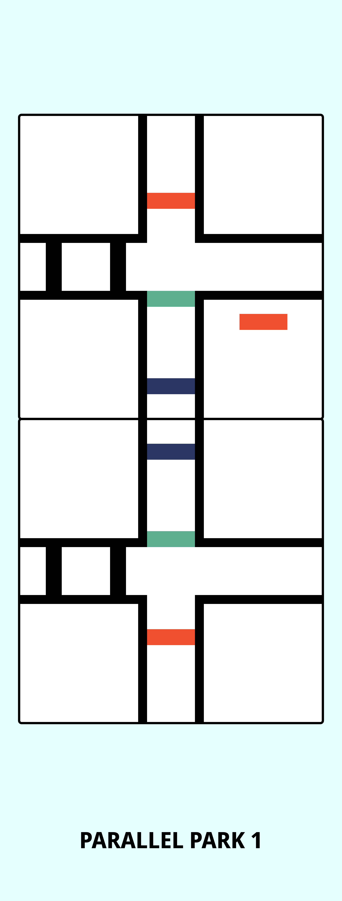

# First LEGO®️ League (FLL) Robotics
## Curriculum Modules

### BEGINNER MODULES
<tabcaption>
<i><b>Table 1.</b> List of thirteen (13) beginner curriculum modules.</i>
</tabcaption>

| module_ID                    | module_name                                                                                     | training_level |
|:-----------------------------|:------------------------------------------------------------------------------------------------|:---------------|
| [BEG-00](#BEG-00)            | [Driving Base Build](1_beginner/BEG-00_Driving-Base-Build.pdf)                                  | BEGINNER       |
| [BEG-01](#BEG-01)            | [Perimeter Square](1_beginner/BEG-01_Perimeter-Square.llsp3)                                    | BEGINNER       |
| [BEG-02](#BEG-02)            | [Black & White (B&W) Stop-n-Go](1_beginner/BEG-02_B&W-Stop-n-Go.llsp3)                          | BEGINNER       |
| [BEG-03](#BEG-03)            | [Red Green Blue (RGB) Speed Variation](1_beginner/BEG-03_RGB-Speed-Variation.llsp3)             | BEGINNER       |
| [BEG-04](#BEG-04)            | [Perimeter Forward (FWD)](1_beginner/BEG-04_Perimeter-FWD.llsp3)                                | BEGINNER       |
| [BEG-05](#BEG-05)            | [Perimeter Force](1_beginner/BEG-05_Perimeter-Force.llsp3)                                      | BEGINNER       |
| [BEG-06](#BEG-06)            | [Parallel Park 1](1_beginner/BEG-06_Parallel-Park-1.llsp3)                                      | BEGINNER       |
| [BEG-A-T](#BEG-A-T)          | [TUT: If Statements](1_beginner/BEG-A-T_If-Then-Statements.llsp3)                               | BEGINNER       |
| [BEG-07](#BEG-07)            | [Maze 1](1_beginner/BEG-07_Maze-1.llsp3)                                                        | BEGINNER       |
| [BEG-08](#BEG-08)            | [Parallel Park 2](1_beginner/BEG-08_Parallel-Park-2.llsp3)                                      | BEGINNER       |
| [BEG-09](#BEG-09)            | [Parallel Park 3](1_beginner/BEG-09_Parallel-Park-3.llsp3)                                      | BEGINNER       |
| [BEG-10](#BEG-10)            | [Maze 2](1_beginner/BEG-10_Maze-2.llsp3)                                                        | BEGINNER       |
| [BEG-11](#BEG-11)            | [Escape of the Walls 1](1_beginner/BEG-11_Escape-of-the-Walls-1.llsp3)                          | BEGINNER       |
| [BEG-12](#BEG-12)            | [Escape of the Walls 2](1_beginner/BEG-12_Escape-of-the-Walls-2.llsp3)                          | BEGINNER       |
| [BEG-B-T](#BEG-B-T)          | [TUT: Steering](1_beginner/INT-B-T_Steering.llsp3)                                              | BEGINNER       |
| [BEG-13](#BEG-13)            | [Freeform Maze](1_beginner/BEG-13_Freeform-Maze.llsp3)                                          | BEGINNER       |
| [BEG-EXIT](#BEG-EXIT)        | [EXIT: Crane Sort](1_beginner/BEG-EXIT_Crane-Sort.llsp3)                                        | BEGINNER       |

### INTERMEDIATE MODULES
<tabcaption>
<i><b>Table 2.</b> List of twelve (12) intermediate curriculum modules.</i>
</tabcaption>

| module_ID                    | module_name                                                                                     | training_level |
|:-----------------------------|:------------------------------------------------------------------------------------------------|:---------------|
| [INT-A-T](#INT-A-T)          | [TUT: Nested If Statements](2_intermediate/INT-A-T_Nested-If-Statements.llsp3)                  | INTERMEDIATE   |
| [INT-00](#INT-00)            | [Plow Build](2_intermediate/INT-00_Plow-Build.pdf)                                              | INTERMEDIATE   |
| [INT-01](#INT-01)            | [Sorting Machine 1](2_intermediate/INT-01_Sorting-Machine-1.llsp3)                              | INTERMEDIATE   |
| [INT-02](#INT-02)            | [Sorting Machine 2](2_intermediate/INT-02_Sorting-Machine-2.llsp3)                              | INTERMEDIATE   |
| [INT-03](#INT-03)            | [Line Follow 1](2_intermediate/INT-03_Line-Follow-1.llsp3)                                      | INTERMEDIATE   |
| [INT-B-T](#INT-B-T)          | [TUT: Gyroscope Sensor](2_intermediate/INT-C-T_Gyro-Sensor.llsp3)                               | INTERMEDIATE   |
| [INT-04](#INT-04)            | [Gyro 1](2_intermediate/INT-04_Gyroscope-1.llsp3)                                               | INTERMEDIATE   |
| [INT-05](#INT-05)            | [Line Follow 2](2_intermediate/INT-05_Line-Follow-2.llsp3)                                      | INTERMEDIATE   |
| [INT-06](#INT-06)            | [Line Follow 3](2_intermediate/INT-06_Line-Follow-3.llsp3)                                      | INTERMEDIATE   |
| [INT-07](#INT-07)            | [Gyro 2](2_intermediate/INT-07_Gyroscope-2.llsp3)                                               | INTERMEDIATE   |
| [INT-08](#INT-08)            | [Gyro 3](2_intermediate/INT-08_Gyroscope-3.llsp3)                                               | INTERMEDIATE   |    
| [INT-09](#INT-09)            | [Training Camp 1](2_intermediate/INT-09_Training-Camp-1.llsp3)                                  | INTERMEDIATE   |
| [INT-10](#INT-10)            | [Training Camp 2](2_intermediate/INT-10_Training-Camp-2.llsp3)                                  | INTERMEDIATE   |
| [INT-11](#INT-11)            | [Training Camp 3](2_intermediate/INT-11_Training-Camp-3.llsp3)                                  | INTERMEDIATE   |
| [INT-12](#INT-12)            | [Guided Mission](2_intermediate/INT-12_Guided-Mission.llsp3)                                    | INTERMEDIATE   |
| [INT-EXIT](#INT-EXIT)        | [EXIT: First LEGO®️ League (FLL) Mission](2_intermediate/INT-EXIT_FLL-Mission.llsp3)             | INTERMEDIATE   |

### ADVANCED MODULES
<tabcaption>
<i><b>Table 3.</b> List of eighteen (18) advanced curriculum modules.</i>
</tabcaption>

| module_ID                    | module_name                                                                                     | training_level |
|:-----------------------------|:------------------------------------------------------------------------------------------------|:---------------|
| [ADV-A-T](#ADV-A-T)          | [TUT: Introduction to MicroPython 1](3_advanced/ADV-A-T_Introduction-to-MicroPython-1.llsp3)    | ADVANCED       |
| [ADV-B-T](#ADV-B-T)          | [TUT: Introduction to MicroPython 2](3_advanced/ADV-B-T_Introduction-to-MicroPython-2.llsp3)    | ADVANCED       |
| [ADV-C-T](#ADV-C-T)          | [TUT: Controlling Motors](3_advanced/ADV-C-T_Controlling-Motors.llsp3)                          | ADVANCED       |
| [ADV-D-T](#ADV-D-T)          | [TUT: Sensor Integration](3_advanced/ADV-D-T_Sensor-Integration.llsp3)                          | ADVANCED       |
| [ADV-E-T](#ADV-E-T)          | [TUT: Custom Functions and Variables](3_advanced/ADV-E-T_Custom-Functions-and-Variables.llsp3)  | ADVANCED       |
| [ADV-F-T](#ADV-F-T)          | [TUT: Loops and Logic Structures](3_advanced/ADV-F-T_Loops-and-Logic-Structures.llsp3)          | ADVANCED       |
| [ADV-01](#ADV-01)            | [Perimeter Square](3_advanced/ADV-01_Perimeter-Square.llsp3)                                    | ADVANCED       |
| [ADV-02](#ADV-02)            | [Perimeter Forward (FWD)](3_advanced/ADV-02_Perimeter-Forward.llsp3)                            | ADVANCED       |
| [ADV-03](#ADV-03)            | [Black & White (B&W) Stop-n-Go](3_advanced/ADV-03_Black-White-Stop-n-Go.llsp3)                  | ADVANCED       |
| [ADV-04](#ADV-04)            | [Red Green Blue (RGB) Speed Variation](3_advanced/ADV-04_RGB-Speed-Variation.llsp3)             | ADVANCED       |
| [ADV-05](#ADV-05)            | [Perimeter Force](3_advanced/ADV-05_Perimeter-Force.llsp3)                                      | ADVANCED       |
| [ADV-06](#ADV-06)            | [Parallel Park 1](3_advanced/ADV-06_Parallel-Park-1.llsp3)                                      | ADVANCED       |
| [ADV-07](#ADV-07)            | [Escape of the Walls 1](3_advanced/ADV-07_Escape-of-the-Walls-1.llsp3)                          | ADVANCED       |
| [ADV-08](#ADV-08)            | [Escape of the Walls 2](3_advanced/ADV-08_Escape-of-the-Walls-2.llsp3)                          | ADVANCED       |
| [ADV-09](#ADV-09)            | [Maze 1](3_advanced/ADV-09_Maze-1.llsp3)                                                        | ADVANCED       |
| [ADV-10](#ADV-10)            | [Parallel Park 2](3_advanced/ADV-10_Parallel-Park-2.llsp3)                                      | ADVANCED       |
| [ADV-11](#ADV-11)            | [Parallel Park 3](3_advanced/ADV-11_Parallel-Park-3.llsp3)                                      | ADVANCED       |
| [ADV-12](#ADV-12)            | [Maze 2](3_advanced/ADV-12_Maze-2.llsp3)                                                        | ADVANCED       |
| [ADV-13](#ADV-13)            | [Freeform Maze](3_advanced/ADV-13_Freeform-Maze.llsp3)                                          | ADVANCED       |
| [ADV-EXIT](#ADV-EXIT)        | [Exit: Crane Sort](3_advanced/ADV-EXIT_Crane-Sort.llsp3)                                        | ADVANCED       |
| [ADV-14](#ADV-14)            | [Spike Prime robotics Challenges: Part 1](3_advanced/ADV-14_Spike-Prime-robotics-Challenges-Part-1.llsp3) | ADVANCED       |
| [ADV-15](#ADV-15)            | [Spike Prime robotics Challenges: Part 2](3_advanced/ADV-15_Spike-Prime-robotics-Challenges-Part-2.llsp3) | ADVANCED       |
| [ADV-16](#ADV-16)            | [Spike Prime robotics Challenges: Part 3](3_advanced/ADV-16_Spike-Prime-robotics-Challenges-Part-3.llsp3) | ADVANCED       |
| [ADV-17](#ADV-17)            | [Data Logging and Analysis](3_advanced/ADV-17_Data-Logging-and-Analysis.llsp3)                  | ADVANCED       |
| [ADV-18](#ADV-18)            | [Wireless Communication and Remote Control](3_advanced/ADV-18_Wireless-Communication-and-Remote-Control.llsp3) | ADVANCED       |

## BEGINNER MODULES

### BEG-00 
#### Driving Base Build

In this foundational module, students will focus on constructing a robust and reliable driving base (robot car). This driving base serves as the platform for all future modules, making it crucial to ensure it is built with structural integrity, proper motor placement, and optimal wheel configurations.

**Outcomes**

1. **Understand Structural Integrity:**
   - **Building Strength:** Students will learn about the importance of a strong and stable base. They will explore various building techniques to enhance the strength and durability of the driving base's base, ensuring it can handle different tasks and challenges effectively.

2. **Master Motor Placement:**
   - **Efficient Motor Setup:** Students will discover how to strategically place motors to achieve balanced and efficient movement. Proper motor placement is crucial for ensuring the driving base moves smoothly and accurately, avoiding issues like tipping or wobbling.

3. **Explore Wheel Configurations:**
   - **Wheel Setup:** Students will experiment with different wheel configurations to determine the most effective setup for their driving base. They will learn how wheel size, positioning, and alignment impact the driving base's performance and maneuverability.

4. **Build the Driving Base:**
   - **Construction:** Following detailed instructions, students will assemble the driving base, applying their knowledge of structural integrity, motor placement, and wheel configurations. They will use various LEGO® pieces to create a sturdy and functional platform for their driving base.

5. **Test and Refine:**
   - **Performance Testing:** Once the driving base is built, students will test its stability and movement. They will make adjustments as needed to improve its performance, ensuring it meets the standards required for future modules.

By the end of this module, students will have constructed a solid driving base that serves as the foundation for their driving baseic projects. This module not only teaches essential building skills but also highlights the importance of a well-designed base for achieving optimal driving base performance.

### BEG-01 - Perimeter Square

In this module, students will program the driving base to move in the shape of a square along the perimeter of a 34" x 34" (86.36 cm x 86.36 cm) table using blue Motor blocks. This activity emphasizes basic movement commands and spatial navigation, providing a strong foundation for understanding driving base motion and control.

**Objectives:**

1. **Learn Basic Movement Commands:**
   - **Motor Control:** Students will understand how to use Motor blocks to control the driving base’s movements. They will learn to make the driving base move forward, execute precise turns, and stop at specific points, building foundational skills in driving base programming.

2. **Program a Square Path:**
   - **Path Programming:** Students will program the driving base to move along the perimeter of a square. This involves moving the driving base forward for a set distance, making a 90-degree turn, and repeating this sequence four times to complete the square. This exercise reinforces the concept of structured movement.

3. **Use Loops for Repetition:**
   - **Loop Implementation:** Students will utilize loops to simplify the programming process. By placing the forward movement and turning commands inside a loop, they ensure the driving base performs these actions four times, making the programming more efficient and reducing redundancy.

4. **Focus on Precision and Accuracy:**
   - **Precision Programming:** Students will learn the importance of precision in programming. They will need to carefully adjust the distance and turning angles to ensure the driving base follows the exact path along the table’s perimeter without deviating from the intended square shape.

By the end of this module, students will have a solid understanding of basic movement commands and the use of loops for repetitive actions. This module will also enhance their spatial awareness and ability to control the driving base's navigation accurately.

### BEG-02 
#### Black & White (B&W) Stop-n-Go

In this module, students will learn how to program a driving base to stop and go based on detecting black and white surfaces. This activity introduces the fundamental concept of line detection and involves repetitive movement using simple "wait until" blocks.

**Objectives:**

1. **Program the driving base’s Movement:**
   - **Basic Movement Programming:** Students will create a program that makes the driving base move forward and then stop when it detects a black surface. The driving base will start moving again upon detecting a white surface. This exercise teaches basic programming logic and how to integrate sensors with movement commands.

2. **Develop Two Distinct Programs:**
   - **Program 1:** Students will use specific blocks to detect black and white colors from a color list. This version helps them understand how to work with predefined color categories and basic color detection.
   - **Program 2:** Students will create a program that uses an integer value representing the percentage of light reflected by the surfaces. This version introduces more granular control, where students need to set thresholds to differentiate between "black" and "white" based on light reflection data.

3. **Understand Line Detection:**
   - **Line Detection Basics:** The module focuses on line detection, a crucial skill for many robotics competitions and practical applications. By programming the driving base to follow lines, students gain valuable experience for more complex tasks in future modules.

4. **Implement Repetitive Movement:**
   - **Using "Wait Until" Blocks:** Students will use "wait until" blocks to continuously check for changes in surface color and adjust the driving base’s movement accordingly. This reinforces the use of control blocks for decision-making and iterative actions.

5. **Test and Refine:**
   - **Performance Testing:** Students will test their programs on a track designed with alternating black and white sections to ensure the driving base responds correctly to surface changes. They will refine their programs based on performance, making adjustments to color detection and movement commands as needed.

By the end of this module, students will have a solid understanding of basic line-following techniques and sensor-based control. This foundation will be essential for tackling more advanced robotics programming tasks in future modules.

### BEG-03 
#### Red Green Blue (RGB) Speed Variation

In this module, students will learn how to program a driving base to adjust its speed based on the colors it detects using color sensors. This activity provides an introduction to sensor-based control systems and the use of basic variables for making dynamic adjustments to the driving base's behavior.

**Objectives:**

1. **Assign Integer Values to Variables:**
   - **Color Detection and Speed Variables:** Students will create variables for each color detected by the driving base’s color sensor and assign specific integer values to these variables. For example:
     - **Red Detection:** When the sensor detects the color red, an integer percentage value, such as 15, is assigned to a variable representing the speed.
     - **Green Detection:** When the sensor detects the color green, a different integer value, such as 50, is assigned to a speed variable.
     - **Blue Detection:** When the sensor detects the color blue, another integer value, such as 65, is assigned to a speed variable.
   - **Variable Usage:** These integer values will be used to control the driving base’s speed, allowing students to see how changing the values affects the driving base's performance.

2. **Program Speed Adjustments:**
   - **Implementing Speed Control:** Students will program the driving base to adjust its speed based on the integer values assigned to the variables. The driving base will operate with varying speeds depending on the color detected:
     - **Red Color:** The driving base will move at a slower speed when it detects red.
     - **Green Color:** The driving base will move at a moderate speed when it detects green.
     - **Blue Color:** The driving base will move at its maximum speed when it detects blue.
   - **Testing and Calibration:** Students will test the driving base on a track or surface with different colors to observe how it changes speed. They will refine their programs to ensure accurate and smooth speed transitions.

3. **Understand Sensor-Based Control Systems:**
   - **Sensor Integration:** Students will gain practical experience with integrating color sensors into their programming. They will learn how sensor inputs can be used to control various aspects of the driving base's behavior.
   - **Dynamic Adjustments:** By using variables to represent different speeds, students will understand how to make dynamic adjustments based on real-time sensor data.

By the end of this module, students will have developed a solid understanding of how to use sensors to influence the driving base's speed and behavior. They will also be comfortable working with variables to make real-time adjustments, laying the groundwork for more complex sensor-based programming tasks in future modules.

### BEG-04 
#### Perimeter Forward (FWD)

In this module, students will program their driving base to move forward until it detects an obstacle using ultrasonic (distance) sensors. This activity introduces basic sensor-based navigation and teaches students how to integrate sensor feedback into their driving base's movement, making it suitable for controlled environments.

**Objectives:**

1. **Program Forward Movement:**
   - **Continuous Forward Motion:** Learn to program the driving base to move forward continuously using Motor (blue) blocks. This foundational skill prepares students for integrating sensor feedback into the driving base’s movement.

2. **Use ultrasonic (distance) sensors:**
   - **Obstacle Detection:** Discover how to use ultrasonic (distance) sensors to detect obstacles. Students will program the driving base to stop moving forward when it senses a wall or obstacle in its path.

3. **Implement Turning Mechanism:**
   - **Turning on Detection:** After detecting a wall, the driving base will turn on the spot clockwise to face 90º from its initial direction. This turning maneuver is crucial for navigating around the perimeter of a defined area.

4. **Continue Navigation:**
   - **Movement Sequence:** Program the driving base to continue moving straight after turning until it senses the next wall. This sequence—move forward, sense wall, turn—will be repeated multiple times to navigate around the perimeter.

5. **Final Movement:**
   - **Completion of Path:** Once the driving base has navigated around three walls and turned accordingly, it will move straight a fixed distance, either in centimeters or inches, to complete its journey around the perimeter.

6. **Test and Refine:**
   - **Performance Testing:** Students will test their program to ensure the driving base navigates the perimeter correctly. They will make adjustments to sensor sensitivity, turning angles, and movement distances to achieve precise navigation.

By the end of this module, students will have a solid understanding of how to integrate ultrasonic (distance) sensors with motor commands to create a responsive driving base capable of navigating around obstacles. This activity lays the groundwork for more complex sensor-based navigation tasks in future modules.

### BEG-05 
#### Perimeter Force

In this module, students will program their driving base to move forward until it encounters a force by bumping into a wall, simulating interactions with physical objects in its environment. This activity introduces the use of Movement (magenta) blocks and force sensors, enhancing students' understanding of sensor-based control systems.

**Objectives:**

1. **Program Forward Movement:**
   - **Continuous Forward Motion:** Learn to program the driving base to move forward continuously using Movement (magenta) blocks. This foundational skill prepares students for integrating force sensor feedback into the driving base’s movement.

2. **Use Force Sensors:**
   - **Collision Detection:** Discover how to use force sensors to detect when the driving base bumps into a wall. Students will program the driving base to stop moving forward when it encounters a force, simulating a collision with an obstacle.

3. **Implement Turning Mechanism:**
   - **Turning on Detection:** After detecting a wall, the driving base will turn on the spot clockwise to face 90º from its initial direction. This turning maneuver is essential for navigating around the perimeter of a defined area.

4. **Continue Navigation:**
   - **Movement Sequence:** Program the driving base to continue moving straight after turning until it encounters another wall. This sequence—move forward, encounter a force, turn—will be repeated multiple times to navigate around the perimeter.

5. **Final Movement:**
   - **Completion of Path:** Once the driving base has navigated around three walls and turned accordingly, it will move straight a fixed distance, either in centimeters or inches, to complete its journey around the perimeter.

6. **Test and Refine:**
   - **Performance Testing:** Students will test their program to ensure the driving base navigates the perimeter correctly. They will adjust the force sensor sensitivity, turning angles, and movement distances to achieve precise navigation.

By the end of this module, students will have a solid understanding of how to integrate force sensors with motor commands to create a responsive driving base capable of detecting and reacting to physical obstacles. This activity lays the groundwork for more complex sensor-based navigation tasks in future modules.

### BEG-06 
#### Parallel Park 1

In this module, students will learn the fundamentals of parallel parking by programming their driving base to fit into a parking space between two blue lines. This activity teaches precise control of the driving base's movements and introduces students to concepts such as turning and reversing based on sensor input.

  

**Objectives:**

1. **Program Forward Movement:**
   - **Initial Approach:** Students will program the driving base to move forward in a straight path until it detects a black line. This step is crucial for positioning the driving base correctly at the start of the parking maneuver.

2. **Implement Counter-Clockwise Turn:**
   - **First Turn:** Upon detecting the black line, the driving base will turn on the spot counter-clockwise by a specific angle (X). This turn is designed to position the driving base at the correct angle to begin the reverse maneuver.

3. **Reverse in a Straight Path:**
   - **Reversing:** Program the driving base to reverse in a straight path. The driving base will continue reversing until it senses the bottom blue line, which indicates it is approaching the end of the parking space.

4. **Perform a Second Counter-Clockwise Turn:**
   - **Second Turn:** Once the bottom blue line is detected, the driving base will turn on the spot counter-clockwise by the same angle (X) used in the first turn. This turn aligns the driving base for the final approach into the parking space.

5. **Move Forward to Final Position:**
   - **Final Approach:** After the second turn, the driving base will move forward continuously until it detects the top blue line. This line signals that the driving base has successfully parked within the space. The driving base will then stop.

6. **Test and Refine:**
   - **Performance Testing:** Students will test their program to ensure the driving base can accurately park between the blue lines. They will make adjustments to the turning angle, movement distances, and sensor sensitivity as needed to improve accuracy and performance.

By the end of this module, students will gain experience in programming precise movements and utilizing sensors for navigation tasks. They will develop a better understanding of how to execute complex maneuvers, such as parallel parking, which is essential for more advanced robotics challenges.

### BEG-A-T 
#### TUT: If Statements

This tutorial introduces the concept of "if statements," which are essential for making decisions in programming. Using if statements allows the driving base to perform different actions based on the conditions it encounters, providing a foundation for conditional programming.

**Objectives:**

1. **Understand If Statements:**
   - **Introduction to Conditionals:** Students will learn how to use if statements to create programs where the driving base makes decisions based on sensor inputs. If statements enable the driving base to execute specific commands only when certain conditions are met.

2. **Program with Color Sensor:**
   - **Detecting Colors:** Students will program the driving base to use a color sensor to detect colored lines that are perpendicular to its path. The driving base will be required to respond differently based on the color it senses.

3. **Implement Actions for Different Colors:**
   - **For Blue:** If the color sensor detects blue, the driving base will perform the following sequence:
     - Turn on the spot counter-clockwise by 90 degrees.
     - Wait for one second.
     - Turn on the spot clockwise by 90 degrees.
   - **For Red:** If the color sensor detects red, the driving base will perform the following sequence:
     - Turn on the spot clockwise by 90 degrees.
     - Wait for one second.
     - Turn on the spot counter-clockwise by 90 degrees.

4. **Develop Two Distinct Programs:**
   - **Program 1 (Using "Wait Until"):** Students will create a program that accomplishes the task using "wait until" blocks. This program will check for color conditions and perform the appropriate actions based on those conditions.
   - **Program 2 (Using "If Statements"):** Students will create a second program that uses if statements to achieve the same task. This approach will demonstrate how if statements can be used to make decisions and control the driving base’s behavior.

5. **Compare and Analyze:**
   - **Evaluate Approaches:** Students will compare the two programs to understand the differences between using "wait until" blocks and if statements. They will analyze how each approach handles decision-making and control flow.

6. **Test and Refine:**
   - **Performance Testing:** Students will test both programs to ensure the driving base responds correctly to different colors and performs the desired actions. They will refine their programs based on the performance results, adjusting the conditions and actions as needed.

By the end of this tutorial, students will gain a solid understanding of if statements and how to use them for conditional programming. They will learn how to create programs that make decisions based on sensor inputs, an essential skill for more complex robotics challenges.

### BEG-07 
#### Maze 1

In this module, students will learn how to program the driving base to navigate through a maze using ultrasonic distance sensors and color sensors. This activity introduces maze-solving algorithms and emphasizes the use of `if` statements for decision-making. Students will program the driving base to follow a specific sequence to escape the maze, focusing on iterative problem-solving with loops and sequential movement commands.

#### Objectives:

1. **Understand Maze Navigation:**
   - Students will learn to navigate a maze constructed using storage bins. The driving base must follow a series of programmed steps to find its way out of the maze.

2. **Program driving base Movement:**
   - The driving base will continuously move forward until it detects a wall using the ultrasonic distance sensor. Upon detecting a wall, it will:
     - Turn on the spot clockwise by 90 degrees.
     - Move forward again until it detects another wall.
     - Turn on the spot clockwise by 90 degrees again.
     - Move forward and continue this pattern until it detects a colored piece of tape on the floor using the color sensor.

3. **Use of If Statements:**
   - Implement `if` statements to manage the driving base's behavior based on sensor inputs:
     - **If** the distance sensor detects a wall, **then** turn the driving base clockwise.
     - **If** the color sensor detects the colored tape, **then** stop the driving base.

4. **Implement Iterative Problem-Solving:**
   - Use loops to repeat the movement and turning actions. This involves programming the driving base to keep moving forward and adjusting its direction when necessary based on the sensor feedback.

5. **Sequential Movement Commands:**
   - Ensure that the driving base performs the correct sequence of actions: moving forward, turning, and checking for colored tape. This sequence helps the driving base systematically navigate the maze.

#### Example Workflow:

1. **Start Moving Forward:**
   - The driving base begins by moving forward continuously.

2. **Detect Wall and Turn:**
   - When the distance sensor detects a wall, the driving base will:
     - Turn on the spot clockwise by 90 degrees.
     - Move forward until it detects another wall.

3. **Repeat Turning and Moving:**
   - Repeat the turning and moving steps until the driving base detects the colored tape with the color sensor.

4. **Stop at Colored Tape:**
   - Once the driving base senses the colored tape, it will stop, indicating that it has reached the end of the maze.

#### Key Concepts:

- **Maze-Solving Algorithms:** Students learn how to solve a maze by programming the driving base to navigate using sensor inputs and predefined movement patterns.
- **If Statements:** Students use `if` statements to make decisions based on sensor data, enabling the driving base to adjust its movement accordingly.
- **Loops and Sequential Commands:** The module reinforces the use of loops to repeat actions and sequential commands to manage the driving base's path through the maze.

By the end of this module, students will have developed skills in maze-solving algorithms, sensor-based decision-making, and iterative programming techniques. They will gain practical experience in applying loops and `if` statements to navigate complex environments.

### BEG-08 
#### Parallel Park 2

In this module, students will advance their skills in parallel parking by programming the driving base to park accurately between two blue lines. This module builds on the fundamentals of parallel parking introduced in previous lessons, with a focus on precise maneuvers and sensor-based adjustments.

#### Objectives:

1. **Program Forward Movement:**
   - Students will program the driving base to move forward continuously until it detects a black line using a color sensor. This forward movement sets the stage for the parking sequence.

2. **Turn on the Spot:**
   - Upon detecting the black line, the driving base will turn on the spot counter-clockwise by a specified angle (X degrees). This precise turning allows the driving base to align itself correctly for the next maneuver.

3. **Reverse in a Straight Path:**
   - After turning, the driving base will reverse in a straight path. The goal here is to back into the parking space, ensuring that it can position itself between the blue lines.

4. **Sense the Bottom Blue Line:**
   - While reversing, the driving base will use a color sensor to detect the bottom blue line marking the edge of the parking space. This helps the driving base determine when it has reached the correct position.

5. **Turn Again:**
   - Once the driving base detects the bottom blue line, it will turn on the spot counter-clockwise by the same angle (X degrees) used earlier. This maneuver helps the driving base align itself within the parking space.

6. **Move Forward Until Close:**
   - The driving base will then move forward continuously until the distance sensor detects an object or wall at a distance less than X centimeters. This ensures that the driving base is positioned correctly within the parking space.

7. **Stop and Park:**
   - Finally, the driving base will stop once it is within the designated area between the top and bottom blue lines. This completes the parallel parking process, placing the driving base accurately in the parking space.

#### Example Workflow:

1. **Move Forward:**
   - Start by moving the driving base forward until it senses the black line.

2. **First Turn:**
   - Turn counter-clockwise by angle X to align the driving base for reversing.

3. **Reverse:**
   - Reverse the driving base in a straight path until it senses the bottom blue line.

4. **Second Turn:**
   - Turn counter-clockwise by angle X again to position the driving base within the parking space.

5. **Final Adjustment:**
   - Move forward until the distance sensor detects an object less than X cm away, ensuring the driving base is properly parked.

6. **Stop:**
   - Stop the driving base between the top and bottom blue lines to complete the parking sequence.

#### Key Concepts:

- **Precision Maneuvering:** The module emphasizes precise control over the driving base’s movements and turns to ensure accurate parking.
- **Sensor Integration:** Students learn to use both color and distance sensors to guide the driving base through the parking process.
- **Sequential Programming:** By following a specific sequence of movements and sensor checks, students reinforce their understanding of how to program complex tasks using conditional logic and loops.

By the end of this module, students will have honed their ability to program the driving base for precise parking maneuvers. They will gain practical experience in integrating multiple sensors and executing a series of programmed steps to achieve accurate results.

### BEG-09 
#### Parallel Park 3
Continuing from the previous module, students tackle more complex parallel parking scenarios. They refine their programming skills with advanced spatial awareness and precise maneuvering using nested loops and condition checks.

### BEG-10 
#### Maze 2
Building upon Maze 1, students explore more intricate maze structures and hone their algorithmic problem-solving abilities. They apply advanced strategies using loops, variables for pathfinding, and conditionals for decision-making.

### BEG-11 
#### Escape of the Walls 1
In this program, students will learn to program the driving base to navigate within a confined space and escape from enclosed areas using ultrasonic (distance) sensor-based decision-making. This module reinforces basic navigation skills and introduces simple nested  loops.

#### Objectives:

1. **Understand Navigation Within Enclosed Spaces:**
   - Students will learn to navigate an enclosed space with various walls of storage bins. The driving base must follow a series of programmed steps to loop around the space while avoiding the walls.

2. **Program driving base Movement:**
   - The driving base will continuously move forward until it detects a wall using the ultrasonic distance sensor. Upon detecting a wall, it will:
     - Turn on the spot counter-clockwise by 90 degrees.
     - Move forward again until it detects another wall.
     - Repeat these action until the driving base returns to its original position, then loop around the space once more

3. **Use of Nested Loops:**
   - Implement `nested` loops to repeat larger sets of actions:
     - **Loop** the forwards and turning movement, upon detecting a wall, to move in a full square.
     - **Loop** the former loop of moving in a square to repeat the action and cycle through the square again.

4. **Implement Iterative Problem-Solving:**
   - Use loops to repeat the movement and turning actions. This involves programming the driving base to keep moving forward and adjusting its direction when necessary based on the sensor feedback.

5. **Sequential Movement Commands:**
   - Ensure that the driving base performs the correct sequence of actions: moving forward, turning. Ensure that the movement is looped correctly such that the base moves as throughout the square only 2 times. 

#### Example Workflow:

1. **Start Moving Forward:**
   - The driving base begins by moving forward continuously.

2. **Detect Wall and Turn:**
   - When the distance sensor detects a wall, the driving base will:
     - Turn on the spot counter-clockwise by 90 degrees.
     - Move forward until it detects another wall.

3. **Repeat Turning and Moving:**
   - Repeat the turning and moving steps until the driving base returns to its original position

4. **Repeat Previous Movement:**
   - Repeat the driving base’s previous movement so that it returns to its original position once more.

By the end of this module, students will have developed skills in nesting loops, sensor-based decision-making, and iterative programming techniques. They will gain practical experience in applying loops and 'if' statements to navigate complex environments.

### BEG-12 
#### Escape of the Walls 2
In this program, students will learn to program the driving base to navigate within a confined space and escape from enclosed areas using force sensor-based decision-making. This module reinforces basic navigation skills and introduces simple nested loops.

#### Objectives:

1. **Understand Navigation Within Enclosed Spaces:**
   - Students will learn to navigate an enclosed space with various walls of storage bins. The driving base must follow a series of programmed steps to loop around the space while avoiding the walls.

2. **Program Driving Base Movement:**
   - The driving base will continuously move forward until it bumps into a wall using the force sensor. Upon encountering a wall, it will:
     - Move backwards straight for half a wheel rotation.
     - Turn on the spot counter-clockwise by 90 degrees.
     - Move forward again until it encounters another wall.
     - Repeat these actions until the driving base returns to its original position, then loop around the space once more.

3. **Use of Nested Loops:**
   - Implement `nested` loops to repeat larger sets of actions:
     - **Loop** the forwards, backwards, and turning movements upon encountering a wall to move in a full square.
     - **Loop** the former loop of moving in a square to repeat the action and cycle through the square again.

4. **Implement Iterative Problem-Solving:**
   - Use loops to repeat the movement and turning actions. This involves programming the driving base to keep moving forward and adjusting its direction when necessary based on the sensor feedback.

5. **Sequential Movement Commands:**
   - Ensure that the driving base performs the correct sequence of actions: moving forward, moving backwards, turning, and repeating. Ensure that the movement is looped correctly such that the base moves throughout the square only 2 times.

#### Example Workflow:

1. **Start Moving Forward:**
   - The driving base begins by moving forward continuously.

2. **Detect Wall, Move Backwards, and Turn:**
   - When the force sensor detects a wall, the driving base will:
     - Move backwards straight for half a wheel rotation.
     - Turn on the spot counter-clockwise by 90 degrees.
     - Move forward until it encounters another wall.

3. **Repeat Moving Backwards, Turning, and Moving Forward:**
   - Repeat the moving backwards, turning, and moving forward steps until the driving base returns to its original position.

4. **Repeat Previous Movement:**
   - Repeat the driving base’s previous movement so that it returns to its original position once more.

By the end of this module, students will have developed skills in nesting loops, sensor-based decision-making, and iterative programming techniques. They will gain practical experience in applying loops and 'if' statements to navigate complex environments.

### BEG-13 
#### Freeform Maze
Students apply their programming skills to navigate custom-made mazes with irregular shapes and obstacles. This module enhances adaptability, problem-solving, and creativity using loops, variables, and advanced decision-making.

### BEG-EXIT 
#### EXIT: Crane Sort
An exit module where students demonstrate their understanding of crane sorting concepts through practical implementation. It tests their ability to apply basic programming concepts to real-world scenarios.

## INTERMEDIATE MODULES

### INT-A-T
#### TUT: Nested If Statements
This tutorial delves into nested if statements, enabling students to create more complex conditional logic structures for advanced programming tasks. It builds on the foundational if statements introduced earlier.

### INT-B-T
#### TUT: Steering
Students learn about steering mechanisms and how to implement them in their programs for executing precise and calculated turns. They apply nested "wait until" blocks and loops for controlled movement.

### INT-00
#### Plow Build
Guides students through constructing a plow attachment, emphasizing mechanical design and attachment building skills. It integrates motor control with precise movement commands and introduces variables for speed adjustments.

### INT-01
#### Sorting Machine 1
Students explore basic sorting algorithms by programming the driving base to sort objects based on predefined criteria such as color. They utilize sequential commands and "wait until" blocks for condition checks.

### INT-02
#### Sorting Machine 2
Building on Sorting Machine 1, this module challenges students to implement more sophisticated sorting algorithms. They develop algorithms using loops and variables to handle complex sorting tasks efficiently.

### INT-03
#### Line Follow 1
Students delve into line-following algorithms, programming the driving base to follow lines of varying shapes and colors using light sensors. They apply iterative movement commands and basic loop structures.

### INT-C-T
#### TUT: Gyroscope (Gyro) Sensor
Introduces students to the gyro sensor for precise navigation and orientation control in their driving bases. They learn to integrate gyro data with movement commands and apply nested "wait until" blocks for controlled navigation.

### INT-04
#### Gyro 1
Students integrate gyro sensor data into their driving base's control system, enhancing navigation accuracy. They apply advanced gyro control techniques with nested loops for precise turns and movement adjustments.

### INT-05
#### Line Follow 2
Building upon Line Follow 1, this module challenges students with more complex line-following scenarios. They refine their programming skills with advanced sensor integration and decision-making using nested loops and conditionals.

### INT-06
#### Line Follow 3
Continuing from Line Follow 2, students tackle advanced line-following challenges such as intersections and loops. They apply complex algorithms using nested loops, variables for speed control, and conditionals for adaptive navigation.

### INT-07
#### Gyro 2
Students delve deeper into gyro sensor integration, exploring advanced techniques for precise turning, heading correction, and navigation control. They apply nested loops and conditionals for advanced driving baseic maneuvers.

### INT-08
#### Gyro 3
Building on Gyro 2, this module challenges students with complex navigation tasks such as following curved paths and navigating obstacle courses. They apply sophisticated algorithms using nested loops, variables, and conditionals for adaptive navigation.

### INT-09
#### Training Camp 1
The first in a series of training camp modules focusing on practical exercises to reinforce programming concepts and driving base control skills. It integrates basic to intermediate programming skills with structured challenges.

### INT-10
#### Training Camp 2
Continuing from Training Camp 1, this module offers more challenging exercises to further enhance students' programming proficiency and problem-solving abilities. It includes advanced navigation tasks using nested loops and conditionals.

### INT-11
#### Training Camp 3
The final installment of the training camp series, providing comprehensive challenges to test students' programming skills and creativity. It integrates all previously learned concepts into complex driving baseic missions using advanced programming techniques.

### INT-12
#### Guided Mission
Students apply their programming knowledge to complete specific tasks and achieve predefined objectives in a guided mission. They demonstrate proficiency in advanced driving baseic maneuvers using loops, variables, and conditionals.

### INT-EXIT
#### EXIT: First LEGO®️ League (FLL) Mission
An exit module indicating completion of intermediate-level training. Students demonstrate readiness for advanced challenges by completing a guided FLL mission. It tests their ability to apply advanced programming concepts in real-world scenarios.

## ADVANCED MODULES

### ADV-A-T
#### TUT: Introduction to MicroPython 1
Introduces students to MicroPython programming for LEGO SPIKE Prime, covering basic syntax, variables, and control structures. It lays the foundation for advanced programming techniques in MicroPython.

### ADV-B-T
#### TUT: Introduction to MicroPython 2
Building on Introduction to MicroPython 1, this module dives deeper into MicroPython concepts including functions, modules, and advanced data types. Students apply their knowledge to develop more complex programs.

### ADV-C-T
#### TUT: Controlling Motors
Students learn advanced motor control techniques in SPIKE Prime such as PID control, synchronized movement, and complex motion profiles. They apply these techniques to create precise and efficient driving baseic movements.

### ADV-D-T
#### TUT: Sensor Integration
Students learn to integrate various sensors with SPIKE Prime including gyroscopes, color sensors, and ultrasonic (distance) sensors for advanced driving baseic applications. They develop sensor fusion techniques to enhance driving base navigation and interaction capabilities.

### ADV-E-T
#### TUT: Custom Functions and Variables
Students learn to create custom functions and variables in SPIKE Prime to streamline their code, improve readability, and enhance code maintainability. They apply these skills to develop modular and efficient driving baseic programs.

### ADV-F-T
#### TUT: Loops and Logic Structures
This module covers advanced loop structures and logical operations in SPIKE Prime, enabling students to write more efficient and complex programs. They apply nested loops and conditionals for adaptive driving baseic behaviors.

### ADV-01
#### Perimeter Square
Students program the driving base to move in the shape of a square using Motor blocks. They apply advanced movement commands and precision control techniques to achieve accurate geometric shapes.

### ADV-02
#### Perimeter Forward (FWD)
Program the driving base to move forward until it detects an obstacle using ultrasonic (distance) sensors. Students refine their sensor integration skills and apply advanced navigation algorithms for obstacle avoidance.

### ADV-03
#### Black & White (B&W) Stop-n-Go
This module teaches students to program the driving base to stop and go based on detecting black and white surfaces. They apply advanced line-following techniques using nested "wait until" blocks for adaptive navigation.

### ADV-04
#### Red Green Blue (RGB) Speed Variation
Students explore programming the driving base to adjust its speed based on detecting colors using color sensors. They develop algorithms for dynamic speed control and apply variables for color recognition and speed adjustment.

### ADV-05
#### Perimeter Force
Program the driving base to move until it encounters a force, simulating interactions with physical objects in its environment. Students apply advanced force sensor integration and develop algorithms for responsive driving base behaviors.

### ADV-06
#### Parallel Park 1
This module introduces the concept of parallel parking, teaching students how to program the driving base to maneuver into tight spaces using precise movements. They apply advanced spatial awareness and motor control techniques.

### ADV-07
#### Escape of the Walls 1
Students program the driving base to navigate within a constrained space and escape from enclosed areas using sensor-based decision-making. They develop strategies for dynamic path planning and adaptive navigation using nested loops.

### ADV-08
#### Escape of the Walls 2
Building upon Escape of the Walls 1, students further refine their programming skills to navigate more complex enclosed spaces with varying decision patterns. They apply advanced decision-making algorithms using nested loops and conditionals.

### ADV-09
#### Maze 1
Introduction to maze-solving algorithms where students program the driving base to navigate through predefined mazes using ultrasonic (distance) sensors. They develop advanced pathfinding algorithms using loops, variables, and conditionals.

### ADV-10
#### Parallel Park 2
An advanced parallel parking module challenging students to program the driving base to navigate into even tighter spaces with greater precision. They apply advanced spatial awareness and motor control techniques using nested loops and conditionals.

### ADV-11
#### Parallel Park 3
Continuing from Parallel Park 2, students tackle more complex parallel parking scenarios. They refine their programming skills with advanced spatial awareness and precise maneuvering using nested loops and conditionals.

### ADV-12
#### Maze 2
Building upon Maze 1, students explore more intricate maze structures and hone their algorithmic problem-solving abilities. They apply sophisticated pathfinding algorithms using loops, variables, and conditionals for adaptive navigation.

### ADV-13
#### Freeform Maze
Students apply their programming skills to navigate custom-made mazes with irregular shapes and obstacles. This module enhances adaptability, problem-solving, and creativity using loops, variables, and advanced decision-making.

### ADV-EXIT
#### EXIT: Crane Sort
An exit module indicating completion of advanced-level training, where students demonstrate their understanding of crane sorting concepts through practical implementation. It tests their ability to apply advanced programming concepts to real-world scenarios.

### ADV-14
#### SPIKE Prime robotics Challenges: Part 1
Students engage in challenging robotics tasks and missions designed to test their problem-solving skills and creativity using SPIKE Prime. They apply comprehensive programming techniques including loops, variables, and conditionals.

### ADV-15
#### SPIKE Prime robotics Challenges: Part 2
Continuing from Part 1, this module offers more complex challenges and missions for students to tackle, further enhancing their robotics capabilities. They apply advanced programming skills to solve intricate driving baseic tasks using SPIKE Prime.

### ADV-16
#### SPIKE Prime robotics Challenges: Part 3
The final installment of the robotics challenges series, providing students with the most advanced and intricate missions to showcase their skills. They demonstrate mastery of advanced programming concepts through complex driving baseic tasks using SPIKE Prime.

### ADV-17
#### Data Logging and Analysis
Students learn to collect and analyze data from sensors in SPIKE Prime, enabling them to make informed decisions and optimizations in their driving baseic projects. They develop data logging algorithms using loops, variables, and conditionals for data-driven insights.

### ADV-18
#### Wireless Communication and Remote Control
This module explores wireless communication protocols and methods for remote controlling SPIKE Prime driving bases. Students develop collaborative and interactive projects using advanced communication techniques and apply them in real-time driving baseic scenarios.
